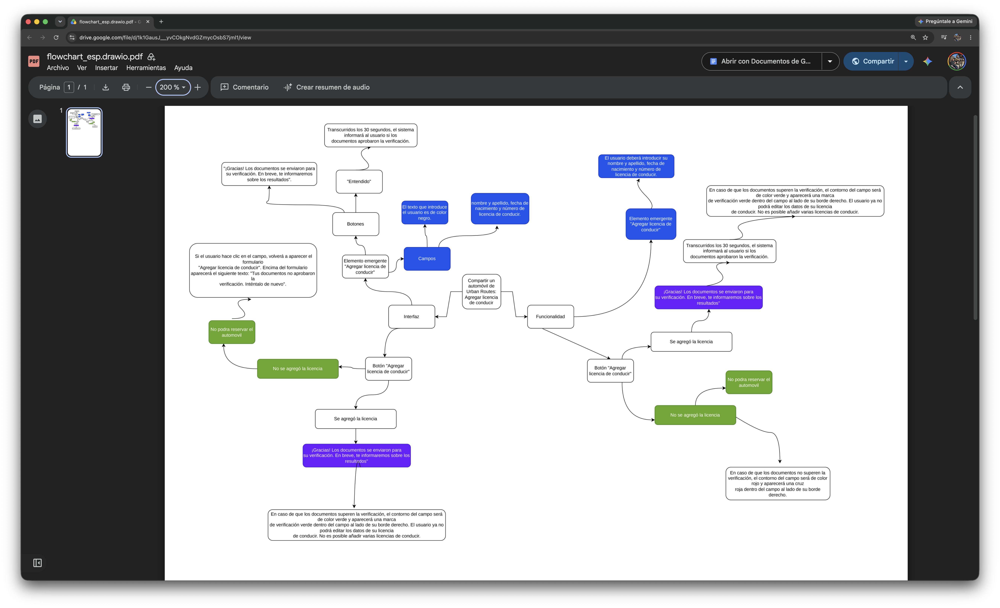
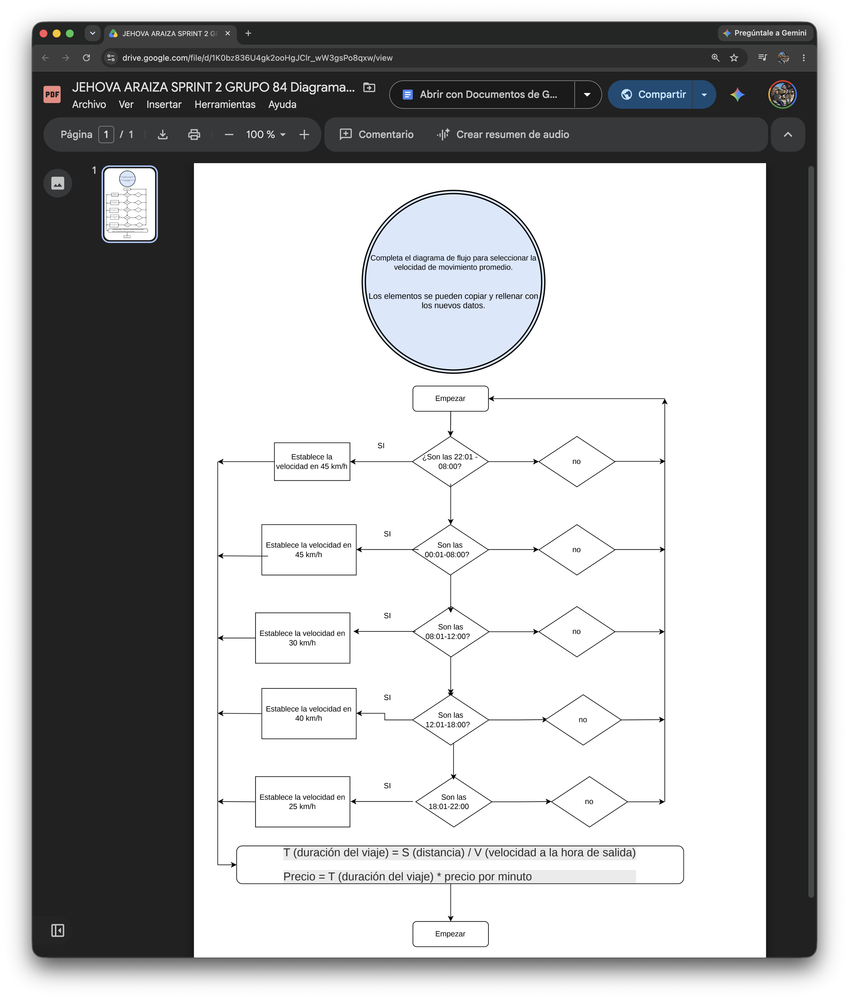
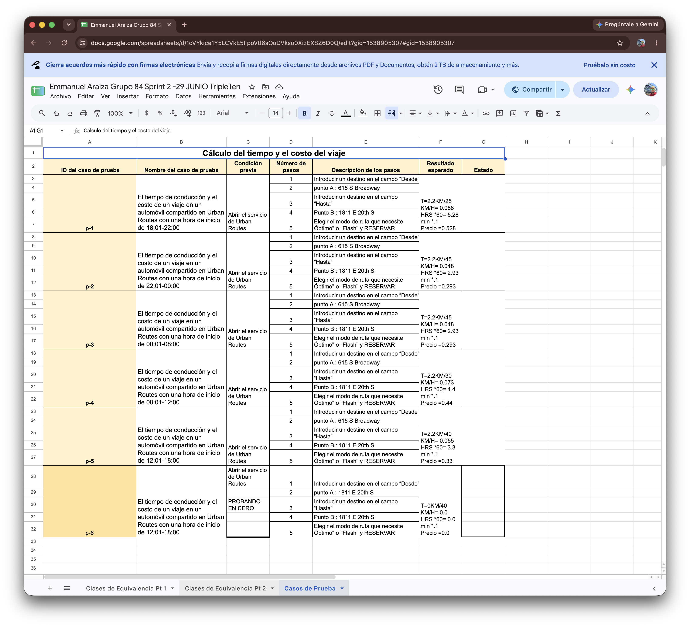

# 📑 Requirements Analysis & Test Design Techniques

Este repositorio contiene la documentación del análisis funcional de especificaciones técnicas y la aplicación de técnicas formales de diseño de pruebas (**Partición de Clases de Equivalencia** y **Análisis de Valores Límite - BVA**) desarrolladas como parte del programa de Software Quality Assurance de TripleTen.

---

## 🎯 Objetivo del Proyecto

Optimizar la cobertura de pruebas y minimizar la redundancia de casos de prueba mediante la desintegración sistemática de requisitos, identificación de zonas grises y derivación de valores de prueba válidos e inválidos para interfaces de usuario y campos de entrada de datos.

---

## 🧠 Técnicas y Metodologías Aplicadas

* **Análisis y Descomposición de Requisitos:** Revisión de especificaciones, criterios de aceptación e identificación de objetos de prueba.
* **Partición de Clases de Equivalencia (Equivalence Partitioning):** Agrupación de datos de entrada en clases válidas e inválidas para reducir ejecuciones innecesarias.
* **Análisis de Valores Límite (Boundary Value Analysis - BVA):** Identificación de bordes del sistema (mínimos, máximos, inmediatamente dentro y fuera de límites) para detectar errores en fronteras de código.
* **Diseño de Escenarios Positivos y Negativos:** Estructuración de flujos para confirmar el comportamiento esperado y el manejo adecuado de excepciones.

---

## 🛠️ Herramientas Utilizadas

* **Mapeo y Visualización:** Mapas mentales y diagramas de flujo para lógica de requisitos.
* **Gestión Documental:** Google Sheets (Matriz de Clases de Equivalencia, Valores Límite y Casos de Prueba).
* **Documentación Técnica:** Creación de listas de comprobación y reportes estandarizados.

---

## 📊 Matriz de Pruebas y Evidencia Técnica

Puedes consultar la documentación técnica completa y las tablas de análisis de valores límite en el siguiente enlace:

---

## ✍️ Autor

**Jehova Emmanuel González Araiza**  
*QA Automation Engineer | Industrial Engineer*  
* [LinkedIn](https://linkedin.com/in/emmanuel-araiza-engineer)
* [GitHub](https://github.com/Emmanuelaraiza90)

---

## 📸 Artefactos Visuales & Análisis Técnico

**Visualización y Descomposición de Requisitos:**

*Mapa mental para la identificación de objetos de prueba y descomposición de reglas de negocio.*

*Diagrama de flujo para el mapeo de decisiones, zonas grises y lógica funcional del sistema.*

**Técnicas Formales de Cobertura (EP & BVA):**

*Partición de Clases de Equivalencia y Análisis de Valores Límite (BVA) para la eliminación de ejecuciones redundantes.*
